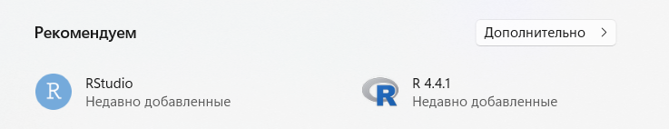
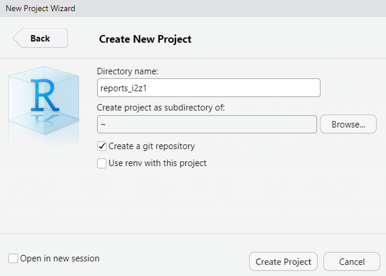
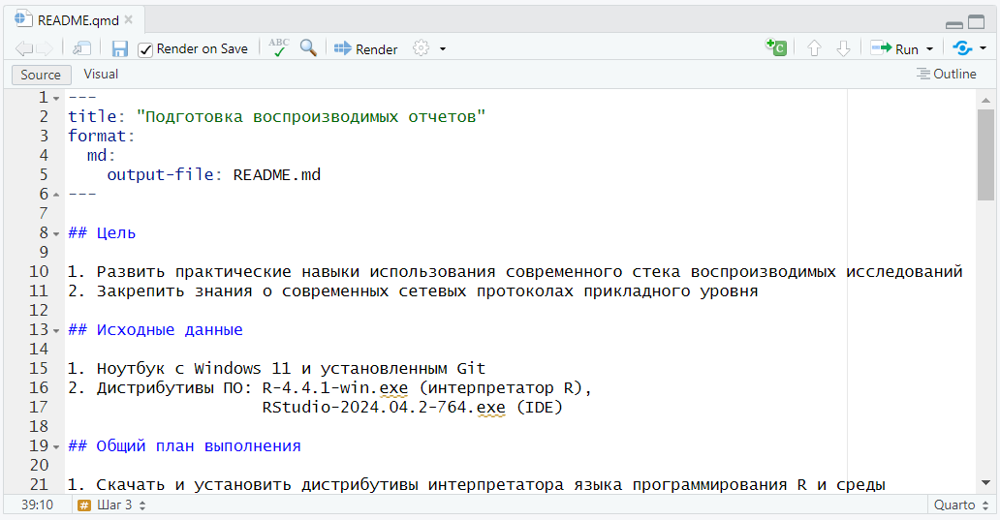
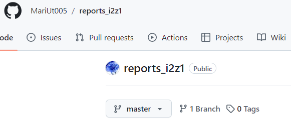
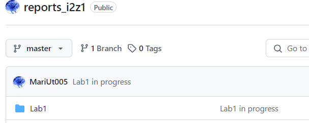

# Подготовка воспроизводимых отчетов


## Цель

1.  Развить практические навыки использования современного стека
    воспроизводимых исследований
2.  Закрепить знания о современных сетевых протоколах прикладного уровня

## ️Исходные данные

1.  Ноутбук c Windows 11 и установленным Git
2.  Дистрибутивы ПО: R-4.4.1-win.exe (интерпретатор R),
    RStudio-2024.04.2-764.exe (IDE)

## Варианты решения задачи

При создании воспроизводимых отчётов могут быть использованы: R Markdown
и Quarto. Оба варианта предлагают достаточный функционал для дальнейшей
работы, но Quarto предлагает более перспективные возможности, в связи с
чем был выбран именно он.

## ️Общий план выполнения

1.  Скачать и установить дистрибутивы интерпретатора языка
    программирования R и среды разработки RStudio
2.  Создать проект и локальный репозиторий
3.  Создать отчет по практической работе
4.  Создать удаленный репозиторий на GitHub и связать его с локальным
5.  Добавить результат выполнения шагов отчет и получить рендер файла
    qmd в md
6.  Выполнить add, commit и push локального репозитория на Github

## Содержание ЛР

### Шаг 1

Установлены R 4.4.1 и RStudio.



### Шаг 2

Создан проект и локальный репозиторий.



### Шаг 3

Создан отчет по практической работе в виде файла qmd. Отчет может
включать код на R:

``` r
print('Hello World!')
```

    [1] "Hello World!"



### Шаг 4

Создан удаленный репозиторий на GitHub



Делаем commit всех внесенных изменений и связываем локальный репозиторий
с удаленным, после чего синхронизируем их:

``` bash
git remote add reports_i2z1 https://github.com/MariUt005/reports_i2z1
git push --set-upstream reports_i2z1 master
```

## Оценка результата

По завершении всех вышеперечисленных шагов локальный репозиторий,
содержащий отчет к первой лабораторной работе, был синхронизирован с
удаленным и готов к дальнейшей проверке:



## Вывод

В результате выполнения работы были подготовлены и освоены основные
инструменты для создания и работы с локальными и удаленными
репозиториями, подготовки воспроизводимых отчетов и программирования на
языке программирования R.
