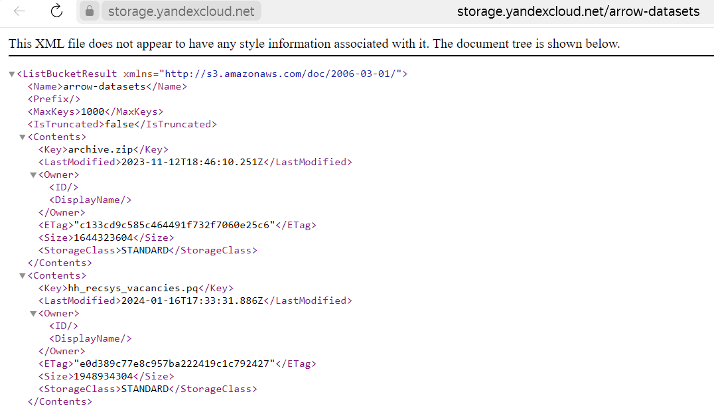
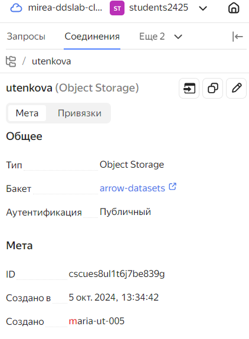
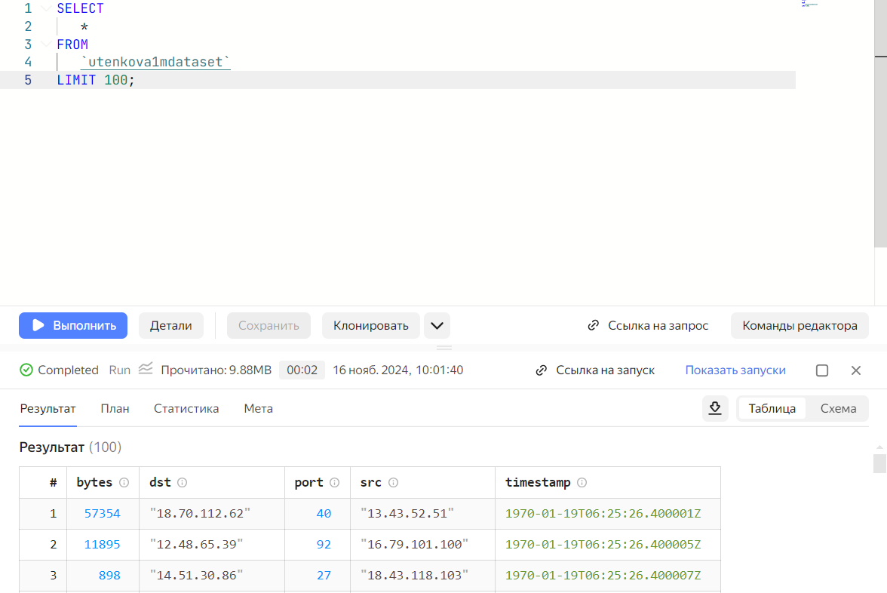
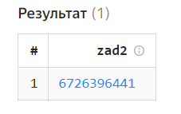
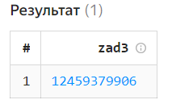

# Использование технологии Yandex Query для анализа данных сетевой
активности


## Цель

1.  Изучить возможности технологии Yandex Query для анализа
    структурированных наборов данных
2.  Получить навыки построения аналитического пайплайна для анализа
    данных с помощью сервисов Yandex Cloud
3.  Закрепить практические навыки использования SQL для анализа данных
    сетевойактивности в сегментированной корпоративной сети

## ️Исходные данные

1.  Ноутбук c Windows 11 и установленным Git, R и RStudio
2.  Доступ к Yandex Query

## ️Ход работы

1.  Проверить доступность данных в Yandex Object Storage

2.  Подключить бакет как источник данных для Yandex Query

3.  Анализ. Решение следующих заданий:

    1.  Известно, что IP адреса внутренней сети начинаются с октетов,
        принадлежащих интервалу \[12-14\]. Определите количество хостов
        внутренней сети, представленных в датасете.
    2.  Определите суммарный объем исходящего трафика
    3.  Определите суммарный объем входящего трафика

4.  Оформить отчет в соответствии с шаблоном

## Содержание ЛР

### Шаг 1

Данные в Yandex Object Storage доступны по ссылке
<https://storage.yandexcloud.net/arrow-datasets>



### Шаг 2

Соединение создано



Создание привязки:


Тестирование соединения и привязки:



### Шаг 3

Анализ

1.  Известно, что IP адреса внутренней сети начинаются с октетов,
    принадлежащих интервалу \[12-14\]. Определите количество хостов
    внутренней сети, представленных в датасете.

    ``` sql
    SELECT COUNT(DISTINCT src) AS zad1
    FROM `utenkova1mdataset`
    WHERE src LIKE '12.%' OR src LIKE '13.%' OR src LIKE '14.%';
    ```

    

2.  Определите суммарный объем исходящего трафика

    ``` sql
    SELECT SUM(bytes) as zad2
    FROM `utenkova1mdataset`
    WHERE (src LIKE '12.%' OR src LIKE '13.%' OR src LIKE '14.%') and (dst NOT REGEXP '(^1[2-4]\.)');
    ```

    

    ``` r
    sprintf("%f GB", 6726396441/1024/1024/1024)
    ```

        [1] "6.264445 GB"

3.  Определите суммарный объем входящего трафика

    ``` sql
    SELECT SUM(bytes) as zad3
    FROM `utenkova1mdataset`
    WHERE (src NOT REGEXP '(^1[2-4]\.)') AND (dst REGEXP '(^1[2-4]\.)');
    ```

    

    ``` r
    sprintf("%f GB", 12459379906/1024/1024/1024)
    ```

        [1] "11.603702 GB"

## Оценка результатов

Задача выполнена при помощи Yandex Query, удалось изучить возможности
технологии Yandex Query для анализа структурированных наборов данных,
получить навыки построения аналитического пайплайна для анализа данных.

## Вывод

В данной работе успешно удалось изучить возможности технологии Yandex
Query для анализа структурированных наборов данных, получить навыки
построения аналитического пайплайна для анализа данных с помощью
сервисов Yandex Cloud, закрепить практические навыки использования SQL
для анализа данных сетевойактивности в сегментированной корпоративной
сети.
