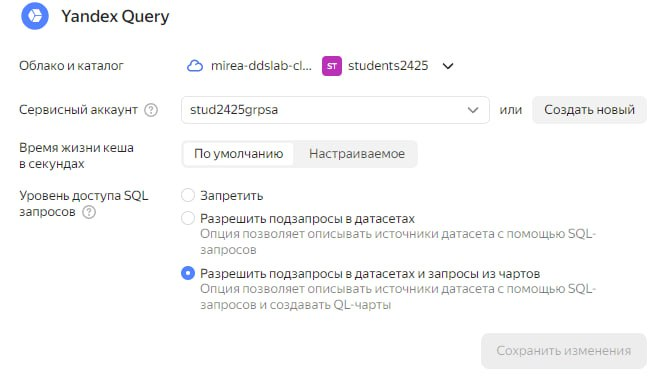

# Использование Yandex DataLens для анализа данных сетевой активности


## Цель

1.  Изучить возможности технологии Yandex DataLens для визуального
    анализа структурированных наборов данных
2.  Получить навыки визуализации данных для последующего анализа с
    помощью сервисов Yandex Cloud
3.  Получить навыки создания решений мониторинга/SIEM на базе облачных
    продуктов и открытых программных решений
4.  Закрепить практические навыки использования SQL для анализа данных
    сетевой активности в сегментированной корпоративной сети

## ️Исходные данные

1.  Ноутбук c Windows 11 и установленным Git, R и RStudio
2.  Доступ к Yandex DataLens

## ️Ход работы

1.  Используя сервис Yandex DataLens настроить доступ к результатам
    Yandex Query
2.  Представить в виде круговой диаграммы соотношение внешнего и
    внутреннего сетевого трафика
3.  Представить в виде столбчатой диаграммы соотношение входящего и
    исходящего трафика из внутреннего сетвого сегмента.
4.  Построить график активности (линейная диаграмма) объема трафика во
    времени.
5.  Все построенные графики вывести в виде единого дашборда в Yandex
    DataLens
6.  Оформить отчет в соответствии с шаблоном

## Содержание ЛР

### Шаг 1. Настроить подключение к Yandex Query из DataLens

1.  Используя сервис Yandex DataLens настроить доступ к результатам
    Yandex Query
    -   Перейти в соответствующий сервис https://datalens.yandex.ru/
    -   Выбрать “Подключения” – “Создать новое подключение”
    -   Выбрать в разделе “Файлы и сервисы” Yandex Query
    -   Настроить и проверить подключение




### Шаг 2. Круговая диаграмма соотношения внешнего и внутреннего трафика


### Шаг 3. Столбчатая диаграмма соотношения входящего и исходящего трафика


### Шаг 4. График активности (линейная диаграмма) объема трафика во времени


### Шаг 5. Дашборд

``` r
print("Создан дашборд")
```

    [1] "Создан дашборд"


Ссылка на дашборд: https://datalens.yandex/7srytif3o9ysu

## Оценка результатов

Задача выполнена при помощи облачных сервисов Yandex Cloud и технологии
Yandex DataLens, удалось познакомится с их функционалом и особенностями.

## Вывод

В данной работе удалось закрепить практические навыки использования SQL
для анализа данных сетевой активности в сегментированной корпоративной
сети и получить навыки визуализации данных для последующего анализа с
помощью сервисов Yandex Cloud.
