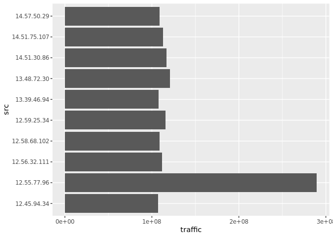
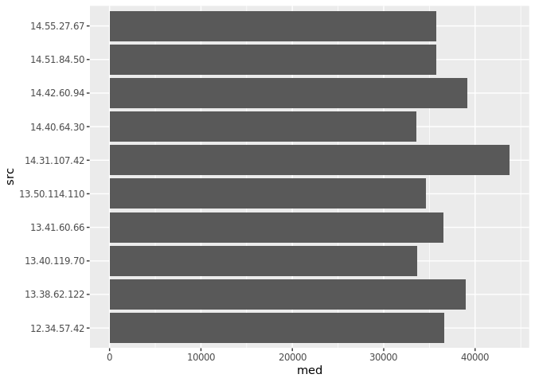

# Анализ данных сетевого трафика при помощи библиотеки Arrow


## Цель

1.  Изучить возможности технологии Apache Arrow для обработки и анализ
    больших данных

2.  Получить навыки применения Arrow совместно с языком программирования
    R

3.  Получить навыки анализа метаинфомации о сетевом трафике

4.  Получить навыки применения облачных технологий хранения, подготовки
    и анализа данных: Yandex Object Storage, Rstudio Server.

## ️Исходные данные

1.  Ноутбук c Windows 11 и установленным Git, R и RStudio, ssh

2.  Доступ к RStudio Server

## ️Ход работы

1.  Подключиться по ssh к удаленному серверу и установить сетевой
    туннель

2.  Подключиться к RStudio Server

3.  Решение заданий:

    1.  Надите утечку данных из Вашей сети.

    2.  Надите утечку данных 2

    3.  Надите утечку данных 3

4.  Оформить отчет в соответствии с шаблоном

## Содержание ЛР

Подготовка данных:

``` r
library(dplyr, warn.conflicts = FALSE)
library(arrow, warn.conflicts = FALSE)
```

    Some features are not enabled in this build of Arrow. Run `arrow_info()` for more information.

``` r
library(tidyverse)
```

    ── Attaching core tidyverse packages ──────────────────────── tidyverse 2.0.0 ──
    ✔ forcats   1.0.0     ✔ readr     2.1.5
    ✔ ggplot2   3.5.1     ✔ stringr   1.5.1
    ✔ lubridate 1.9.3     ✔ tibble    3.2.1
    ✔ purrr     1.0.2     ✔ tidyr     1.3.1

    ── Conflicts ────────────────────────────────────────── tidyverse_conflicts() ──
    ✖ lubridate::duration() masks arrow::duration()
    ✖ dplyr::filter()       masks stats::filter()
    ✖ dplyr::lag()          masks stats::lag()
    ℹ Use the conflicted package (<http://conflicted.r-lib.org/>) to force all conflicts to become errors

``` r
df <- read_parquet('tm_data.pqt')
df <- df %>%
  filter(str_detect(src, "^12.") | str_detect(src, "^13.") | str_detect(src, "^14."))  %>%
  filter(!str_detect(dst, "^12.") & !str_detect(dst, "^13.") & !str_detect(dst, "^14.")) 
```

### Задание 1

Важнейшие документы с результатами нашей исследовательской деятельности
в области создания вакцин скачиваются в виде больших заархивированных
дампов. Один из хостов в нашей сети используется для пересылки этой
информации – он пересылает гораздо больше информации на внешние ресурсы
в Интернете, чем остальные компьютеры нашей сети. Определите его
IP-адрес.

``` r
res1 <- df %>%
  group_by(src) %>%
  summarise(traffic = sum(bytes)) %>%
  arrange(desc(traffic)) %>%
  select(src) %>% collect()
print(head(res1, 1))
```

    # A tibble: 1 × 1
      src         
      <chr>       
    1 13.37.84.125

### Задание 2

Другой атакующий установил автоматическую задачу в системном
планировщике cron для экспорта содержимого внутренней wiki системы. Эта
система генерирует большое количество трафика в нерабочие часы, больше
чем остальные хосты.

Определите IP этой системы. Известно, что ее IP адрес отличается от
нарушителя из предыдущей задачи.

Установка ggplot2:

``` r
install.packages("ggplot2")
```

    Installing package into '/home/user24/R/x86_64-pc-linux-gnu-library/4.4'
    (as 'lib' is unspecified)

Подготовка данных:

``` r
library(dplyr)
library(ggplot2)
library(lubridate)

df <- df %>%
  filter(!str_detect(src, "^13.37.84.125"))

dftime <- df %>%
      select(timestamp, src, dst, bytes) %>%
      mutate(time = hour(as_datetime(timestamp/1000)))

dfdatetime <- df %>%
      select(timestamp, src, dst, bytes) %>%
      mutate(time = as_datetime(timestamp/1000))
```

``` r
bytraffic <- dftime %>%
      group_by(time) %>%
      summarise(traffic = sum(bytes), count = n()) %>% 
      arrange(desc(traffic)) %>% collect()

bycount <- bytraffic %>% arrange(desc(count)) %>% collect()

avgPerHost <- bytraffic %>% mutate(avg = traffic/count) %>% arrange(desc(avg)) %>% collect()

res <- dftime %>%
      filter(time < 16) %>% 
      group_by(src) %>%
      summarise(traffic = sum(bytes)) %>%
      arrange(desc(traffic)) %>% collect()

res7 <- dftime %>%
      filter(time == 7) %>% 
      group_by(src) %>%
      summarise(traffic = sum(bytes)) %>%
      arrange(desc(traffic)) %>% collect()

res1255 <- dfdatetime %>%
      filter(src == '12.55.77.96') %>% collect()
```

Анализ данных:

``` r
ggplot(data = bytraffic, aes(x = time, y = traffic)) + 
  geom_line() +
  geom_point()
```


``` r
ggplot(data = bytraffic, aes(x = time, y = count)) + 
  geom_line() +
  geom_point()
```


Так как с 16 до 24 объем трафика и количество запросов стабильно высоки
с сравнении с другими часами, этот интервал является рабочими часами.

``` r
ggplot(head(res, 10), aes(traffic, src)) + geom_col()
```



Заметно, что в нерабочие часы трафик наибольший у 12.55.77.96

``` r
ggplot(data = avgPerHost, aes(x = time, y = avg)) +
  geom_line() + 
  geom_point()
```


Так как в 7 часов был значительный всплеск среднего трафика на хост, что
является аномалией, скорее всего именно в этот период происходила утечка
данных.

``` r
ggplot(head(res7, 10), aes(traffic, src)) + geom_col()
```


Заметно, что в 7 часов трафик наибольший у 12.55.77.96.

``` r
ggplot(data = res1255, aes(x = time, y = bytes)) + 
  geom_line() +
  geom_point()
```


Каждый день у 12.55.77.96 был всплеск трафика в 7 утра. Таким образом,
именно у этой системы был настроен cron для экспорта содержимого
внутренний wiki системы.

### Задание 3

Еще один нарушитель собирает содержимое электронной почты и отправляет в
Интернет используя порт, который обычно используется для другого типа
трафика. Атакующий пересылает большое количество информации используя
этот порт, которое нехарактерно для других хостов, использующих этот
номер порта. Определите IP этой системы. Известно, что ее IP адрес
отличается от нарушителей из предыдущих задач.

Подготовка данных:

``` r
library(dplyr)
library(ggplot2)
library(lubridate)

df <- df %>%
  filter(src != '12.55.77.96')
```

``` r
dfport <- df %>%
  select(src, port, bytes)
```

``` r
dfportstat <- dfport %>%
  group_by(port) %>%
  summarise(med = median(bytes), max = max(bytes), razn = max - med) %>%
  arrange(desc(razn)) %>% collect()

print(dfportstat)
```

    # A tibble: 46 × 4
        port    med    max    razn
       <int>  <dbl>  <int>   <dbl>
     1    37 30669  209402 178733 
     2    39 30713  198527 167814 
     3   105 30598. 197766 167168.
     4    40 30579  195144 164565 
     5    75 30685  194650 163965 
     6    89 30628  194106 163478 
     7   102 30645  193588 162943 
     8    81 30721  192430 161709 
     9   119 30623  190151 159528 
    10    74 30679  189818 159139 
    # ℹ 36 more rows

``` r
ggplot(data = dfportstat, aes(x = port, y = razn)) + geom_col()
```


Скорее всего подозрительным портом является один из первой десятки тех,
у которых нибольшая разница между медианой и максимальным значением
переданного трафика за раз.

#### Порт 37

``` r
p = 37
dfportN <- dfport %>%
  filter(port == p) %>%
  group_by(src) %>%
  summarise(traffic = sum(bytes), count = n(), avg = traffic/count, med = median(bytes)) %>%
  arrange(desc(avg)) %>% collect()

ggplot(head(dfportN, 10), aes(avg, src)) + geom_col()
```


``` r
ggplot(head(dfportN, 10), aes(med, src)) + geom_col()
```



Для прота 37 (топ-1) замечена аномальная активность на src =
14.31.207.42, но разница со вторым местом src = 14.42.60.94 минимальна.

#### Порт 39

``` r
p = 39
dfportN <- dfport %>%
  filter(port == p) %>%
  group_by(src) %>%
  summarise(traffic = sum(bytes), count = n(), avg = traffic/count, med = median(bytes)) %>%
  arrange(desc(avg)) %>% collect()

ggplot(head(dfportN, 10), aes(avg, src)) + geom_col()
```


``` r
ggplot(head(dfportN, 10), aes(med, src)) + geom_col()
```


Для порта 39 (топ-2) замечена аномальная активность: src = 13.36.102.77.

#### Порт 105

``` r
p = 105
dfportN <- dfport %>%
  filter(port == p) %>%
  group_by(src) %>%
  summarise(traffic = sum(bytes), count = n(), avg = traffic/count, med = median(bytes)) %>%
  arrange(desc(avg)) %>% collect()

ggplot(head(dfportN, 10), aes(avg, src)) + geom_col()
```


``` r
ggplot(head(dfportN, 10), aes(med, src)) + geom_col()
```


Для порта 105 (топ-3) замечена аномальная активность: src =
14.31.107.42.

#### Порт 40

``` r
p = 40
dfportN <- dfport %>%
  filter(port == p) %>%
  group_by(src) %>%
  summarise(traffic = sum(bytes), count = n(), avg = traffic/count, med = median(bytes)) %>%
  arrange(desc(avg)) %>% collect()

ggplot(head(dfportN, 10), aes(avg, src)) + geom_col()
```


``` r
ggplot(head(dfportN, 10), aes(med, src)) + geom_col()
```


Для порта 40 (топ-4) замечена аномальная активность: src = 13.41.85.73.

#### Порт 75

``` r
p = 75
dfportN <- dfport %>%
  filter(port == p) %>%
  group_by(src) %>%
  summarise(traffic = sum(bytes), count = n(), avg = traffic/count, med = median(bytes)) %>%
  arrange(desc(avg)) %>% collect()

ggplot(head(dfportN, 10), aes(avg, src)) + geom_col()
```


``` r
ggplot(head(dfportN, 10), aes(med, src)) + geom_col()
```


Для порта 75 (топ-5) не замечена аномальная активность.

#### Результат

Наибольшая разница в трафике, который был направлен через один порт,
получена на порту 105. Ответ на задание: 14.31.107.42

## Оценка результатов

Задача выполнена при помощи Apache Arrow, удалось познакомится с
функционалом Arrow для анализа больших данных.

## Вывод

В данной работе успешно удалось изучить возможности Apache Arrow для
анализа данных сетевой активности в сегментированной корпоративной сети.
